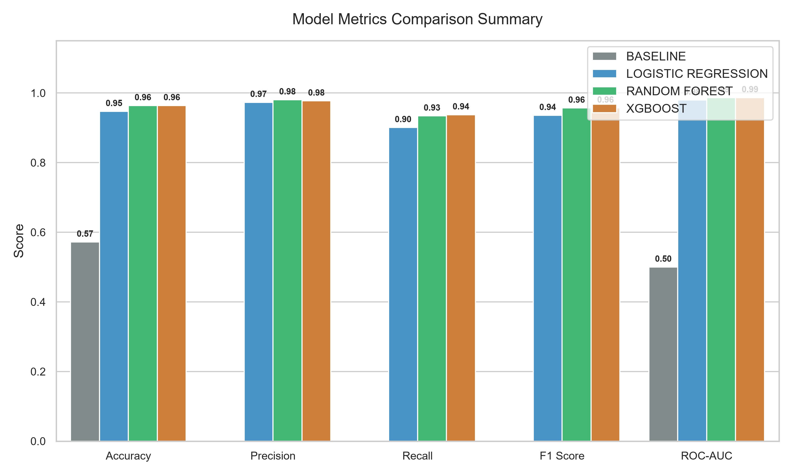
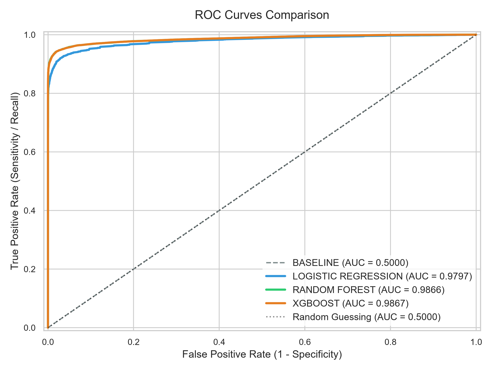
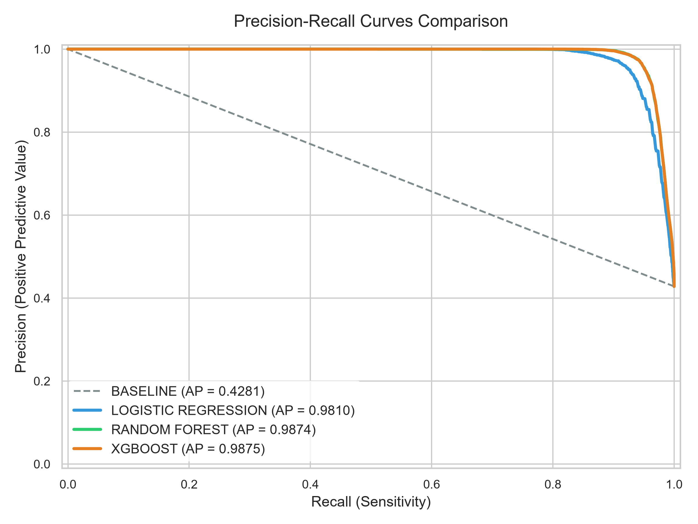
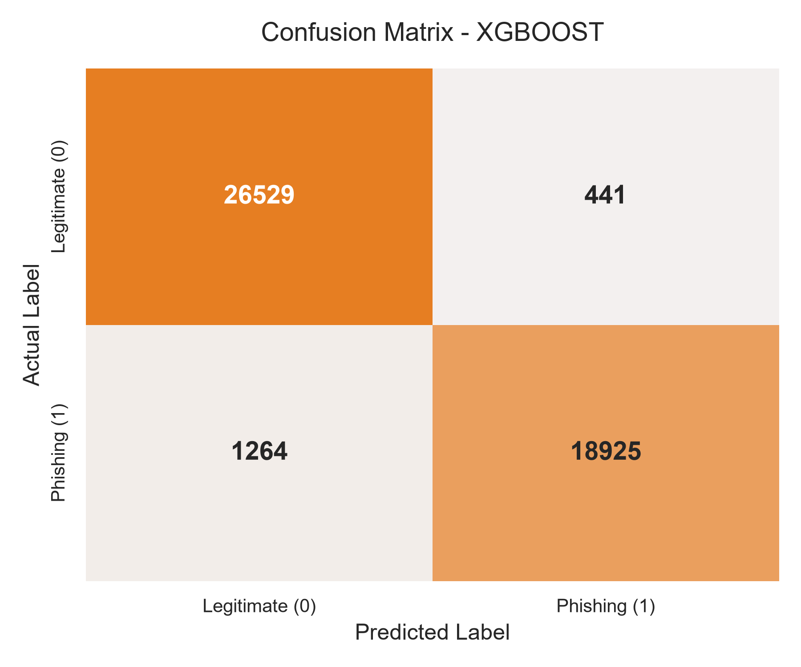
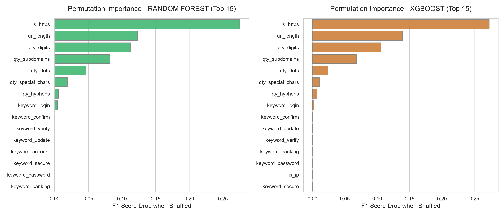

# 🛡️ Phishing URL Detector

---

## 💼 Business Impact & Motivation

Phishing is one of the most common vectors for initial enterprise security breaches, accounting for billions of dollars in annual losses. 

### Why Lexical Phishing Detection Matters:
* **Zero-Day Protection:** Traditional systems rely on static blacklists (e.g., Google Safe Browsing, PhishTank). While effective for known threats, they are blind to newly registered domain names. Machine learning detects structural and lexical patterns, identifying suspicious URLs *before* they are reported.
* **Privacy-First Design:** By classifying URLs strictly based on their text string, this system does not require fetching the target website's content. This prevents leaking user browsing details, reduces network overhead, and prevents local execution of malicious scripts during inspection.
* **Low Latency & Scalability:** With an XGBoost model footprint of only **203 KB**, predictions execute in sub-milliseconds on local CPUs. This makes the detector perfect for high-throughput gateway proxies, firewall filters, browser extensions, or edge networks.

### Key Limitations:
* **Link Shorteners:** Lexical detectors cannot identify the destination of obfuscated links (e.g., `bit.ly/xxxx`). In production, this detector should be combined with a recursive redirect resolver.
* **Adversarial Evading:** Sophisticated attackers alter URL structures to bypass lexical filters. A robust defense-in-depth architecture must combine this classifier with domain reputation checks (WHOIS) and active page content scanners.

---

## 📊 Dataset Overview

This system is trained on the **PhiUSIIL Phishing URL Dataset** (UCI Machine Learning Repository).
* **Total Samples:** 235,795 URLs
* **Class Balance:** 134,850 Legitimate URLs (57.19%) vs. 100,945 Phishing URLs (42.81%)
* **Label Encoding:** Legitimate = `0`, Phishing = `1` (labels are inverted in preprocessing from the raw dataset to match standard threat detection conventions).

See [DATASET_DESCRIPTION.md](docs/DATASET_DESCRIPTION.md) for details on target label alignment and attributes.

---

## 🏗️ Pipeline Architecture

The end-to-end Machine Learning pipeline follows a standard production-grade flow:


1. **Ingestion:** Loading and cleaning raw CSV data from `data/raw/`.
2. **Feature Extraction:** Handcrafting a 16-dimensional feature vector from the URL.
3. **Preprocessing:** Scaling numerical variables using a fitted `StandardScaler` saved to `models/scaler.joblib`.
4. **Training:** Training and saving four classifiers (Baseline, Logistic Regression, Random Forest, XGBoost) to `models/`.
5. **Evaluation:** Building confusion matrices, ROC/PR curves, and printing a tabular benchmark summary.
6. **Serialization:** Picking the top model and saving it as `models/best_model.joblib`.
7. **Prediction CLI:** Running live predictions via terminal.

---

## 🛠️ Handcrafted Feature Engineering

A raw URL string is converted into a 16-dimensional vector consisting of:

| Feature Name | Type | Description |
| :--- | :--- | :--- |
| `url_length` | Numerical | Total number of characters in the URL string |
| `qty_digits` | Numerical | Total count of numerical digits `[0-9]` |
| `qty_dots` | Numerical | Total count of dots `.` (indicates subdomain abuse) |
| `qty_hyphens` | Numerical | Total count of hyphens `-` (mimics legitimate domain brands) |
| `is_https` | Binary | `1` if protocol is HTTPS (case-insensitive), `0` otherwise |
| `is_ip` | Binary | `1` if hostname is an IPv4 or IPv6 address, `0` otherwise |
| `qty_subdomains` | Numerical | Count of subdomains in hostname (excludes top-level and main domain) |
| `qty_special_chars` | Numerical | Sum of special characters commonly used in queries: `@`, `?`, `=`, `&`, and `%` |
| `keyword_[x]` | Binary | `1` if keyword `x` is present in URL string (keywords: `login`, `verify`, `secure`, `update`, `account`, `password`, `banking`, `confirm`) |

---

## 🧪 Model Training & Experiments

We train and track four classifiers, comparing them against resource size and training latency to choose the best production candidate.

### Benchmarks (Stratified 20% Test Holdout):

| Model | Accuracy | Precision | Recall | F1 Score | ROC-AUC | Size on Disk | Training Time |
| :--- | :---: | :---: | :---: | :---: | :---: | :---: | :---: |
| **Baseline Model** | 57.19% | 0.00% | 0.00% | 0.00% | 0.5000 | 1 KB | 0.05s |
| **Logistic Regression** | 94.70% | 97.33% | 90.08% | 93.57% | 0.9797 | 1.5 KB | 1.12s |
| **Random Forest** | 96.38% | **98.05%** | 93.40% | 95.67% | 0.9866 | 6.5 MB | 4.85s |
| **XGBoost Classifier** | **96.38%** | 97.72% | **93.74%** | **95.69%** | **0.9867** | **203 KB** | **3.24s** |

For detailed training parameters and logs, read [benchmark_summary.md](reports/experiments/benchmark_summary.md).

---

## 📈 Evaluation & Performance

All evaluation visuals are programmatically updated inside `assets/plots/` on every execution of `main.py --evaluate`.

### 1. Performance Summary
The model comparison chart illustrates that tree-based classifiers significantly outperform linear models on F1-score and Recall, with XGBoost achieving the best balance.



### 2. ROC and Precision-Recall Curves
The high Area Under the ROC Curve (0.9867) and high Average Precision (0.9859) show that our models maintain exceptional discriminative performance under varying alert thresholds.

| ROC Curves | Precision-Recall Curves |
| :---: | :---: |
|  |  |

### 3. Confusion Matrix (Selected XGBoost Model)
Out of 47,159 test samples, the XGBoost model has only **463 false positives** (0.98% false alarm rate) and **1,264 false negatives**.



---

## 🔍 Explainability & Interpretability

To prevent "black box" machine learning models in security systems, we calculate **Permutation Importance** on the test set. Shuffling features 5 times reveals how critical each indicator is to the model's F1 score.



### Key Findings:
1. **URL Length (`url_length`):** The single most descriptive feature. Phishing URLs are significantly longer than safe links because they pack brand names, verification codes, and tracking parameters.
2. **HTTPS Protocol (`is_https`):** Legitimate websites are almost universally served over HTTPS. Insecure HTTP is a strong sign of threat activity.
3. **Subdomains & Dots (`qty_dots`):** Attackers leverage multi-layered subdomains to mimic secure infrastructure (e.g. `https://login.paypal.com.secure-update.net/`).

---

## ⚙️ Installation & Setup

1. **Clone the repository:**
   ```bash
   git clone https://github.com/limpyf/phishing-url-detector.git
   cd phishing-url-detector
   ```

2. **Create and activate a virtual environment:**
   ```bash
   py -m venv venv
   # Windows:
   .\venv\Scripts\activate
   # Linux/macOS:
   source venv/bin/activate
   ```

3. **Install dependencies:**
   ```bash
   pip install -r requirements.txt
   ```

4. **Add the dataset:**
   Place the raw dataset `PhiUSIIL_Phishing_URL_Dataset.csv` inside `data/raw/`. (See [REPRODUCIBILITY.md](REPRODUCIBILITY.md) for download links).

---

## 💻 CLI Usage Guide

The unified entry script `main.py` is the interface for pipeline operations:

### 1. Preprocess and Train All Models
Runs cleaning, extracts features, performs stratified split, fits numerical scaler, fits all 4 classifiers, and serializes the best candidate:
```bash
python main.py --train
```

### 2. Re-Evaluate and Replot
Loads existing models and scaler, runs test set evaluation, updates comparison tables, and saves updated charts to `assets/plots/`:
```bash
python main.py --evaluate
```

### 3. Live URL Prediction
Predicts the classification of a live URL using the serialized best model (`best_model.joblib`):
```bash
python main.py --predict "https://paypal-security-login.com"
```

**Output Example:**
```text
============================================================
PHISHING URL DETECTOR - ANALYSIS
============================================================
Target URL: https://paypal-security-login.com

Prediction: PHISHING

Confidence: 99.9%

Detected indicators:
 ✓ contains_login
 ✓ multiple_hyphens (2 hyphens)
 ✓ insecure_protocol (HTTP)
============================================================
```
