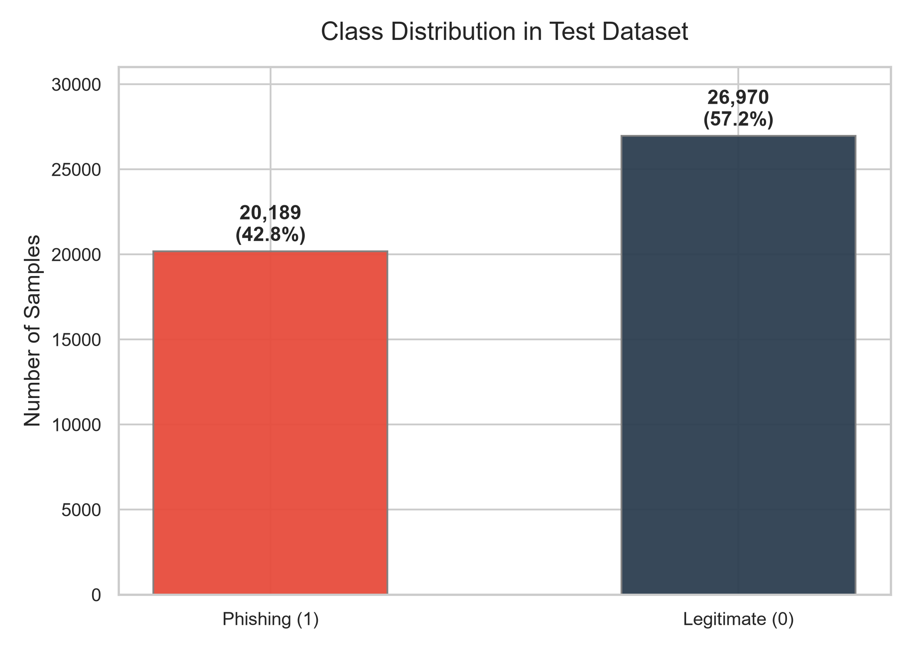
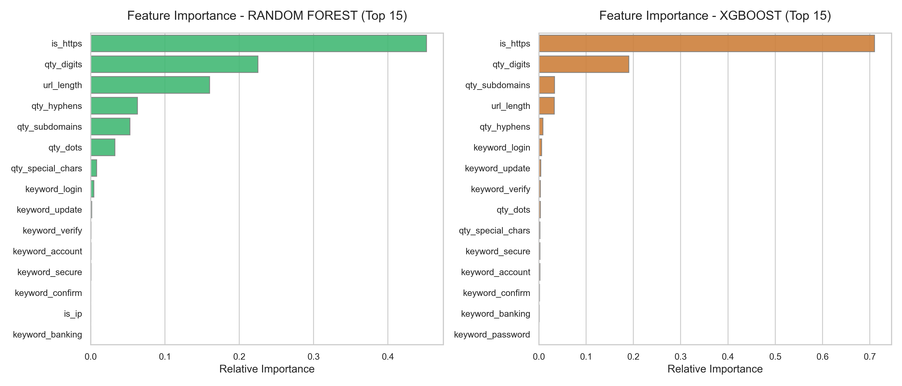
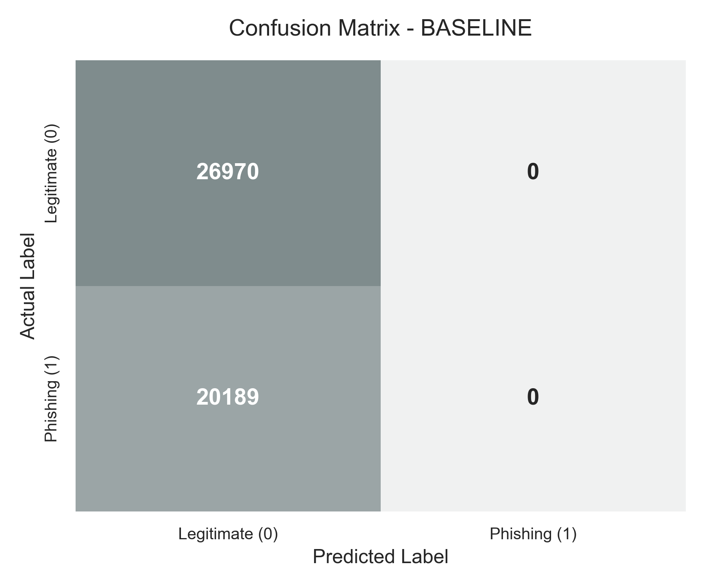
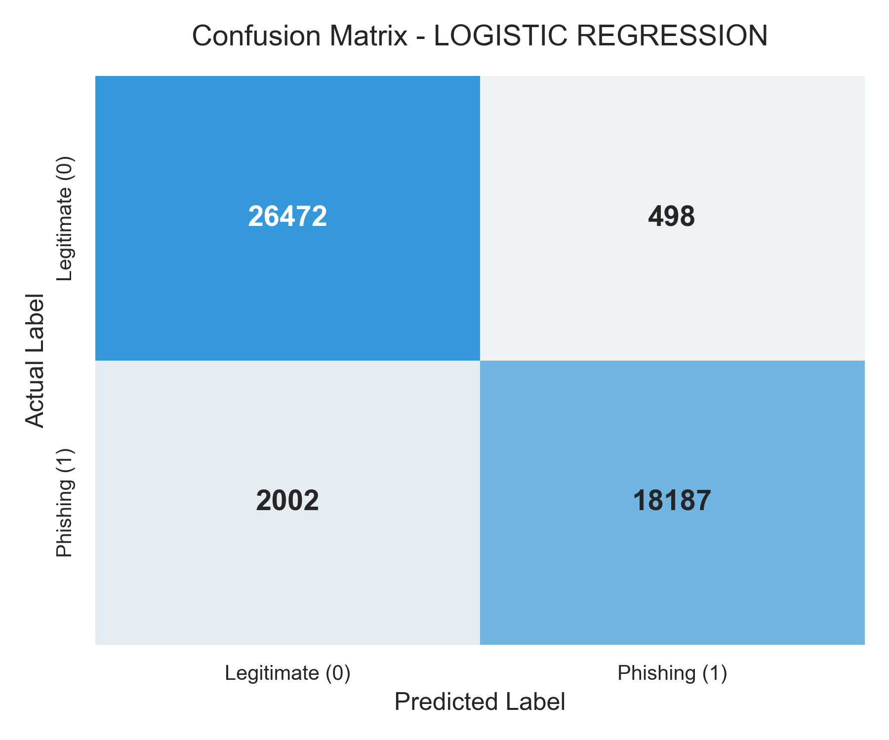
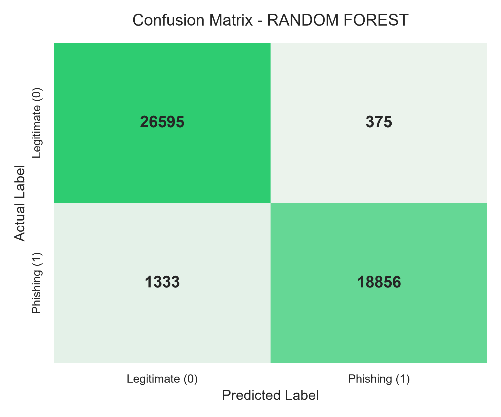

# Machine Learning Based Phishing URL Detection
---

## Project Overview
This project presents an academic, university-grade machine learning system designed to detect **Phishing URLs** by analyzing their lexical, structural, and behavioral features. 

### Team Members
* **Maksim Koval** (mkoval@edu.cdv.pl)
* **Denys Burka** (dburka@edu.cdv.pl)

---

## Motivation
Phishing constitutes one of the most prevalent cyber threats worldwide, wherein deceptive URLs are employed by attackers to mimic trusted brands and extract user credentials. The ineffectiveness of traditional detection systems against newly registered domains stems from their reliance on static blacklists.

Machine learning provides a dynamic alternative through its capacity to identify structural anomalies, suspicious patterns, urgency-inducing keywords, and other distinctive features of phishing URLs, thereby facilitating real-time detection of previously unknown malicious websites.

---

## Dataset
This project utilizes the **PhiUSIIL Phishing URL Dataset** from the UCI Machine Learning Repository 
* **Total Samples:** 235,795 URLs
* **Class Balance:** 134,850 Legitimate URLs (57.19%) vs. 100,945 Phishing URLs (42.81%)

---

## Features

| Feature Name          | Type      |
|----------------------|-----------|
| `url_length`         | Numerical |
| `qty_digits`         | Numerical |
| `qty_dots`           | Numerical |
| `qty_hyphens`        | Numerical |
| `is_https`           | Binary    |
| `is_ip`              | Binary    |
| `qty_subdomains`     | Numerical |
| `qty_special_chars`  | Numerical |
| `keyword_login`      | Binary    |
| `keyword_verify`     | Binary    |
| `keyword_secure`     | Binary    |
| `keyword_update`     | Binary    |
| `keyword_account`    | Binary    |
| `keyword_password`   | Binary    |
| `keyword_banking`    | Binary    |
| `keyword_confirm`    | Binary    |


---

## Models
We train and compare four models:
1. **Baseline Model** (`DummyClassifier`)
2. **Logistic Regression**
3. **Random Forest Classifier**
4. **XGBoost Classifier**

---

## Results

| Model | Accuracy | Precision | Recall | F1 Score | ROC-AUC |
| :--- | :---: | :---: | :---: | :---: | :---: |
| **Baseline Model** | 57.19% | 0.00% | 0.00% | 0.00% | 0.5000 |
| **Logistic Regression** | 94.70% | 97.33% | 90.08% | 93.57% | 0.9797 |
| **Random Forest** | 96.38% | 98.05% | 93.40% | 95.67% | 0.9866 |
| **XGBoost Classifier** | **96.38%** | **97.72%** | **93.74%** | **95.69%** | **0.9867** |

---

## Visualizations

### Class Distribution


### ROC Curves Comparison


### Feature Importance (Random Forest vs. XGBoost)


### Confusion Matrices
| Baseline | Logistic Regression |
| :---: | :---: |
|  |  |

| Random Forest | XGBoost |
| :---: | :---: |
|  |  |

---

## Installation
1. Clone the repository or navigate to the directory.
   ```
    git clone git@github.com:limpyf/phishing-url-detector.git
    cd phishing-url-detector
   ```
2. Create and activate a virtual environment:
   ```powershell
   py -m venv venv
   .\venv\Scripts\activate
   ```
3. Install the dependencies:
   ```powershell
   pip install -r requirements.txt
   ```
4. Place the dataset `PhiUSIIL_Phishing_URL_Dataset.csv` inside the `data/raw/` directory.

---

## Usage

### Full Pipeline Training
```powershell
python main.py --train
```

### Re-Evaluation

```powershell
python main.py --evaluate
```

### Live URL Prediction

```powershell
python main.py --predict "https://paypal-security-login.com"
```

**Output Example:**
```text
============================================================
PHISHING URL DETECTOR - ANALYSIS
============================================================
Target URL: https://paypal-security-login.com

Prediction: PHISHING

Confidence: 99.9%

Detected indicators:
 ✓ contains_login
 ✓ multiple_hyphens (2 hyphens)
============================================================
```

***